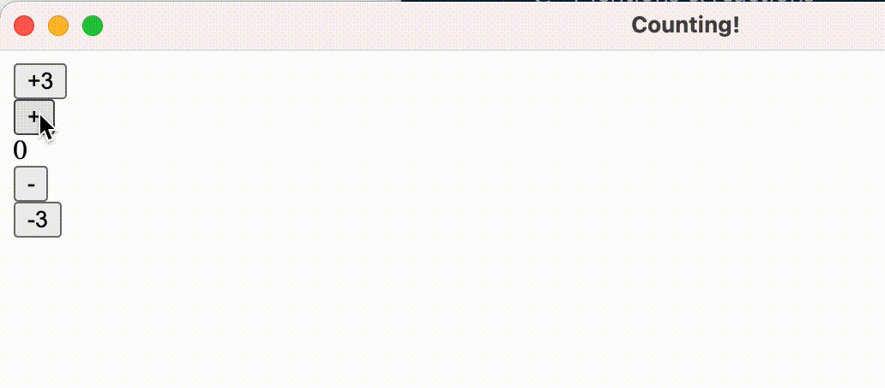

# elm-desktop

WIP, PoC, framework for building desktop apps with Elm. The basic layout is a `Backend.elm`, `Types.elm`, and `Window.YourWindow.elm` which you as the user modify and build your app on top off, e.g. everything in `src/`.

To compile run `npm run build-dev` and to start your app run `npm start`.

> The "plus/minus 3" buttons send values to the backend to be calculated and then sent back to the window, while the "plus/minus 1" buttons do the calculation within the window.

